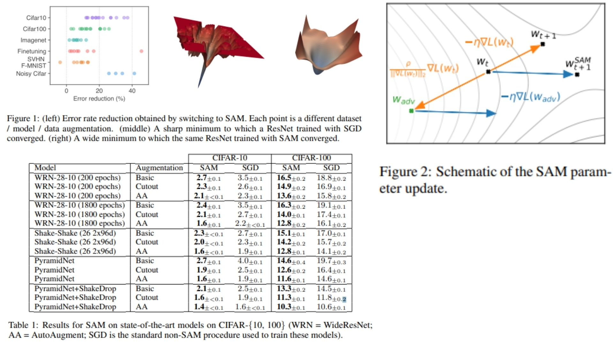

# 🌟 SAM-Replication PyTorch Implementation

This repository contains a replication of **SAM-ResNet18**, integrating **Sharpness-Aware Minimization (SAM)** with a **ResNet-18 backbone**, using PyTorch. The model is designed for **robust and efficient image classification**, applying **perturbations on model weights** to improve generalization.

- Implemented **ResNet-18** with **residual blocks** and **SAM perturbation hooks**.  
- Architecture:  
**Stem → ResNet-18 Blocks → GlobalAvgPool → Flatten → FC**

> **Note on SAM:** Our implementation injects perturbations in model parameters according to the SAM algorithm (`rho` scaling). The wrapper optimizer handles the **perturbation → step → restore** cycle.  

**Paper reference:** [Sharpness-Aware Minimization for Efficiently Improving Generalization](https://arxiv.org/abs/2010.01412) ⚡

---

## 🖼 Overview – SAM + ResNet-18 Architecture

  

- *Figure 1* shows that with SAM we reach “wide & flat” minima — small changes to weights don’t blow up the loss → this helps in achieving better test performance and robustness against small perturbations.  
- *Figure 2* visualizes the two‑step SAM update: first a small perturbation is added to weights, then after re‑evaluating the loss, update is applied — this effectively searches not just for a low‑loss point but for a stable region (“neighborhood”) in parameter space.  
- *Table 1* (from the original paper) reports consistent improvements in test error across datasets (CIFAR‑10/100, ImageNet, etc.) when using SAM — confirming that flat minima translate into real gains in generalization and robustness.  


> **Model highlights:**  
> - Residual connections in ResNet-18 allow gradient flow and prevent vanishing.  
> - SAM perturbation improves generalization without adding extra parameters.  
> - Adaptive pooling + flatten ensures consistent input to FC layer.

---

## 📋 Project Structure

```bash
SAM-Replication/
│
├── src/
│   ├── layers/
│   │   ├── conv_layer.py             # Standard conv layer
│   │   ├── flatten_layer.py          # Flatten layer
│   │   ├── fc_layer.py               # Fully connected layer (num_classes)
│   │   ├── pool_layers/
│   │   │   ├── maxpool_layer.py      # MaxPool
│   │   │   └── avgpool_layer.py      # AdaptiveAvgPool
│   │   ├── sam_perturbation.py       # SAM perturbation calculation (rho, epsilon)
│   │
│   ├── blocks/
│   │   └── resnet_block.py           # ResNet BasicBlock / BottleneckBlock
│   │
│   ├── model/
│   │   └── sam_resnet18.py           # Full model: Stem + ResNet-18 blocks + Classifier + SAM hooks
│   │
│   ├── optimizers/
│   │   └── sam_optimizer.py          # SAM optimizer wrapper (base_optimizer + perturbation)
│   │
│   └── config.py                      # Input size, num_classes, rho, optimizer settings
│
├── images/
│   └── figmix.jpg                     # Figures illustrating SAM + ResNet18
│
├── requirements.txt
└── README.md
```
---

## 🔗 Feedback

For questions or feedback, contact: [barkin.adiguzel@gmail.com](mailto:barkin.adiguzel@gmail.com)
